Participante: Jose Edney Bruno

# PREPARAÇÃO INICIAL:

- Comando para baixar e instalar o AWS CLI.

```
curl "https://awscli.amazonaws.com/awscli-exe-linux-x86_64.zip" -o "awscliv2.zip"
unzip awscliv2.zip
sudo ./aws/install
```

- Foi Criado o AccessKey e SecretKey do meu usuário 'edney' para configurar o AWS CLI como mostra a imagem 'imgs/01.cli.png'.
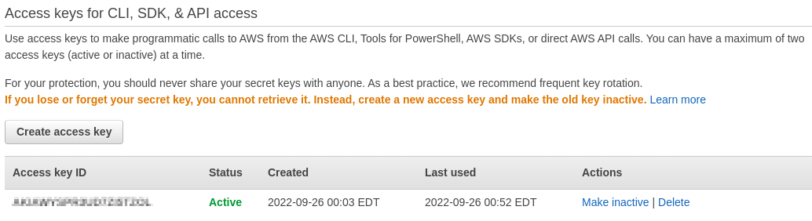

- Executei os comandos mostrados para criação do ambiente e no final cheguei ao resultado da imagem 'imgs/02.criacao-ambiente.png'
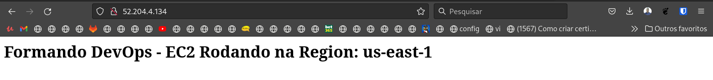

# Desafio AWS

##1 - Setup de ambiente

- Comandos executados para criação do ambiente, utilizando o arquivo: "formandodevops-desafio-aws.json".

```
export STACK_FILE="file://formandodevops-desafio-aws.json"
aws cloudformation create-stack --region us-east-1 --template-body "$STACK_FILE" --stack-name "$STACK_NAME" --no-cli-pager
aws cloudformation wait stack-create-complete --stack-name "$STACK_NAME"
```
- Foram criados na região US-EAST-1:

1 VPC
4 Subnets
1 Route Table
1 Internet Gateway
1 EC2

##2 - Networking

- A página web não estava sendo exibida por erro de configuração de rede:

Fui analisando e o erro estava na configuração do 'Security Group' onde o range de porta estava '81 - 8080' e alterei para '80', e o endereço de origem estava '0.0.0.0/1' onde alterei para '0.0.0.0/0' fazendo com que receba requisições de qualquer endereço, e então cheguei a resposta da imagem 'imgs/03.resposta_2.png'.
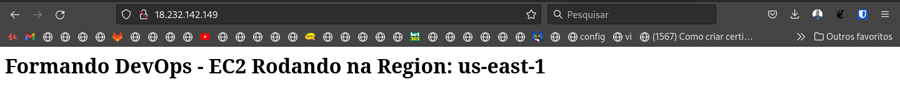

##3 - EC2 Access

- Criei uma nova instancia para suporte na mesma região e mesma AZ.
- Desassociei o volume da instância 'Formando DevOps - AWS Challenge EC2'.
- Associei o volume para a instancia de suporte que foi criada.
- Alterei as permições da chave:
```
chmod 400 desafio_aws.pem
```

- Acessei a instancia de suporte via SSH com a chave 'desafio-aws.pem'
- Executei os comandos:
```
sudo fdisk -l # Para verificar o disco associado.
sudo mount /dev/xvdf1 /mnt #montando a partição
cd /mnt/home/ec2-user/.ssh #Acessando o diretório do ssh do usuário
cat ~/.ssh/authorized_keys > authorized_keys    #Copiei o conteúdo do meu authorized_keys para o usuário da instância 'Formando DevOps - AWS Challenge EC2'
```

- Sai do diretório, desmontei a partição e dei um 'Stop' na instância de suporte.
- Desassociei o volume e associei novamente o dispositivo /dev/xvda a instância 'Formando DevOps - AWS Challenge EC2'.
- Adicionei uma regra no Security Group da instancia para dar acesso via SSH e acessei com minha chave com o comando:
```
ssh -i "desafio-aws.pem" ec2-user@54.162.131.223
```
- Como mostra a imagem 'imgs/04.resposta_3.png' do terminal.
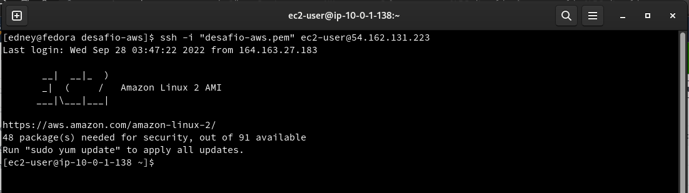

- Alterei o arquivo html colocando meu nome no inicio, mas deu erro no serviço que foi corrigido na questão 4.

##4 - EC2 troubleshooting

- O serviço estava parado e desativado para iniciar no boot.
- Então fiz login como root e dei start no serviço e habilitei com 'enable' para iniciar junto com a instancia no boot.
```
systemctl status httpd      #Para verificar o estado do serviço.
systemctl start httpd       #Iniciei o serviço.
systemctl enable httpd      #Habilitei para iniciar junto no boot.
```

- Assim cheguei ao resultado da imagem 'imgs/05.resposta_4.png'.
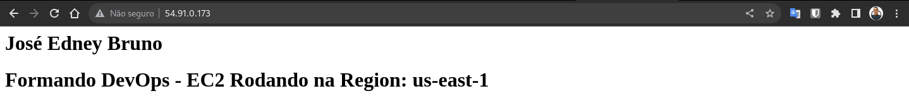

##5 - Balanceamento

- Criei uma AMI da instância 'Formando DevOps - AWS Challenge EC2'.
- A partir dessa AMI criei uma nova instância igual a do desafio, como mostra a imagem 'imgs/06.ami-instancias.png'.
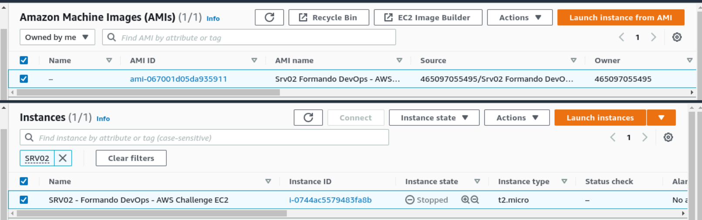

- Criei o Target Group como mostra a imagem 'imgs/07.target-group.png'.
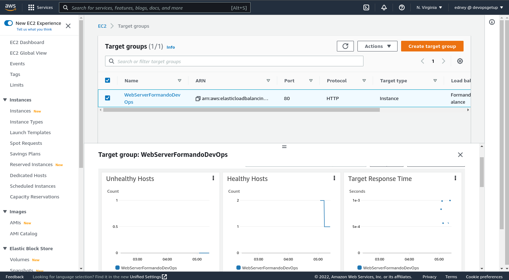

- Criei o Load Balance como mostra a imagem 'imgs/08.load-balance.png'.
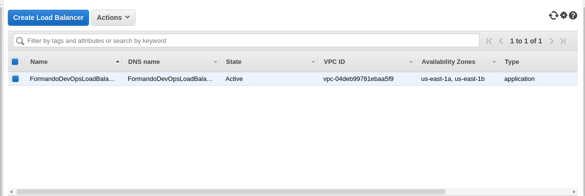

- Acessei a página pelo navegador com o endereço de dns do Load Balance e obtive o resultado da imagem 'imgs/09.resposta_5'.


- Acessei as duas instâncias e coloquei uma tag <h3>Server 01 e 02</h3> para diferenciar qual esta respondendo.
- Parei a instância 'Formando DevOps - AWS Challenge EC2' como mostra a imagem  'imgs/10.instance-stop.png'.
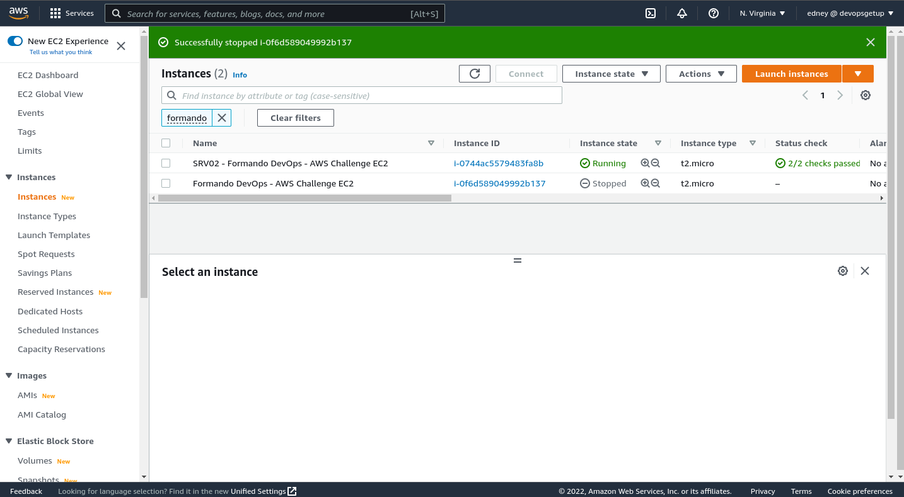

- acessei novamente pelo load balance e a página continua disponível como mostra a imagem 'imgs/11.resposta_5_1.png'.
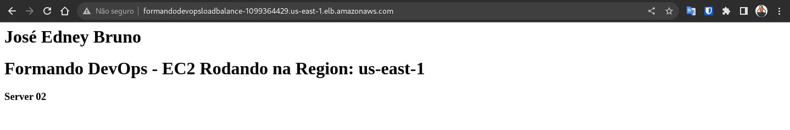

##6 - Segurança

- Criei um Security Group para o Load Balance e adicionei a seguinte regra:
Prot: HTTP, Port: 80, Origem: 0.0.0.0/0     # Recebe requisições de qualquer endereço.

- No Security Group das instâncias eu adicionei a seguinte regra:
Prot: HTTP, Port: 80, Origem: (Security Group do LoadBalance)     # Recebe requisições passando pelo Load Balance.
- Como mostra a imagem 'imgs/12.security-group.png'
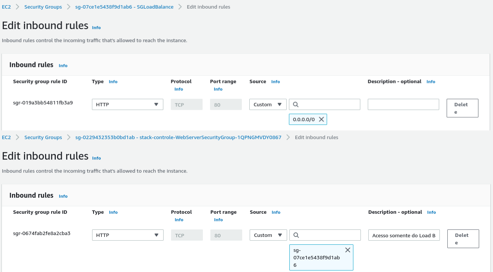

A imagem 'imgs/13.resposta_6.png' mostra as respostas das instâncias e do Load Balance.
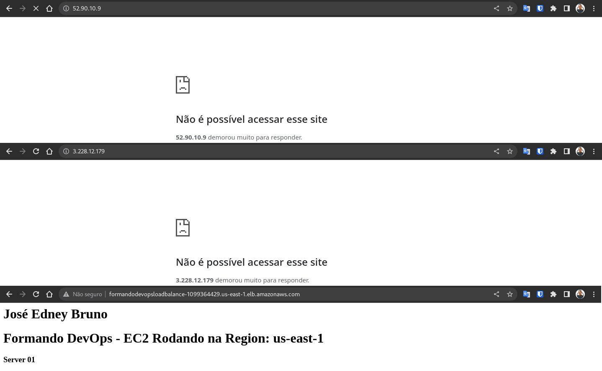
