#Participante: Edney Bruno
#Repositório:
[Repositório] (https://gitlab.com/edneybruno/desafio-gitlab)

### 1.Crie uma conta no Gitlab.

# Preenche os dados e cria a conta, como eu ja tenho uma conta não foi necessário criar outra.

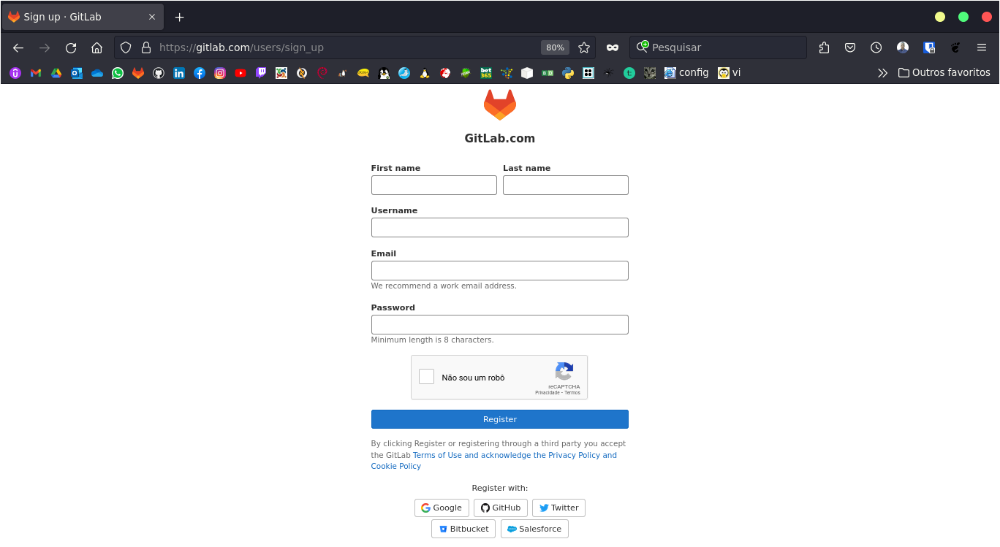

### 2.Crie um repositório público chamado "desafio-gitlab" e clone-o em seu computador.

# Criando um repositório público.

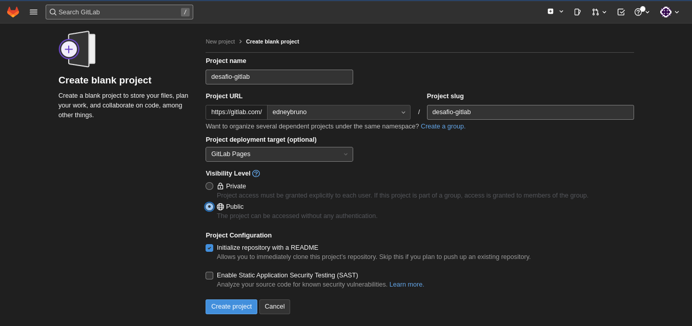

# Clonando o repositório via SSH:

```
git clone git@gitlab.com:edneybruno/desafio-gitlab.git
```

### 3.Adicione os arquivos do desafio ao seu repositório local e faça o primeiro commit.

# Copiando os arquivos para o diretório atual.
```
cp -a ../formando-devops/desafio-gitlab/public .
git status
git add .
git commit -m "Adicionando os arquivos"
```

### 4.Faça o push do seu repositório local para o repositório remoto.

# Fazendo o push pro repositório remoto.

```
git push -u origin main
```

### 5.Mude o texto da página inicial para "Desafio GitLab - Dev".

# Texto alterado na página inicial.

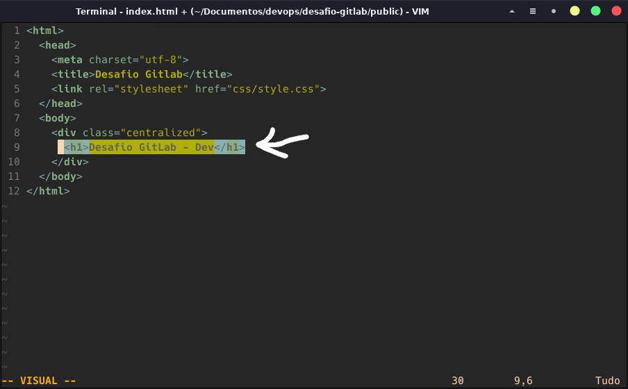

```
git add .
git commit -m "Alterando o texto do index.html para Desafio GitLab - Dev"
git push -u origin main
```

### 6.Crie uma nova branch chamada "feature" e altere o texto da página inicial para "Desafio GitLab - Feature".

# Criando uma nova branch e mudando para a mesma.

```
git checkout -b feature
# Depois de criado a branch, alterei o texto como na imagem.
######git add .
######git commit -m "Alterando o texto do index.html para Desafio GitLab - Feature pela branch feature"
######git push -u origin feature
```

# Texto alterado na página inicial usando a branch feature.

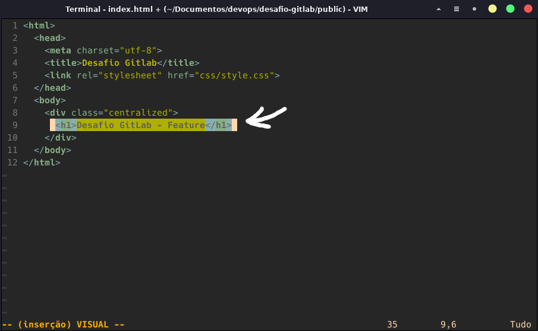

### 7.Crie um pipeline no GitLab CI para fazer o deploy do site estático no GitLab Pages.

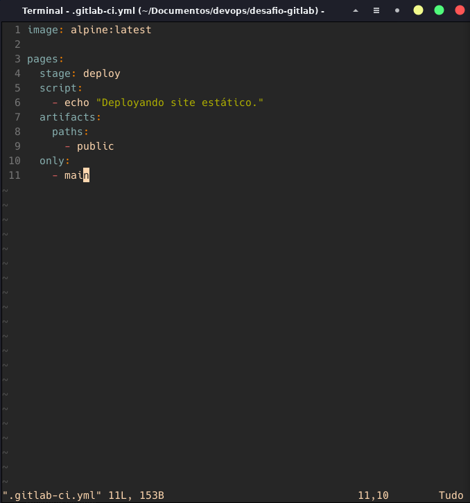

### 8.Faça o merge da branch "feature" para a branch "main".

```
git add .
git commit -m "Alterando o texto do index.html para Desafio GitLab - Feature e criando o arquivo de .gitlab-ci"
git push -u origin feature
```
# Foi criado um Merge Request como mostra a imagem:

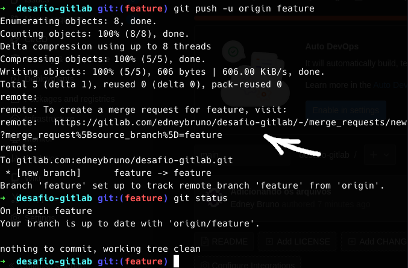

# Então com o link eu crio o merge request.
# E fiz o merge depois de verificar as modificações feita na branch feature.

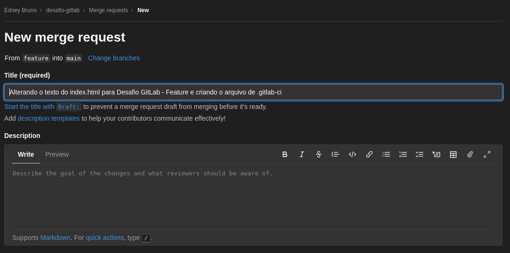

# Fiz o Merge.

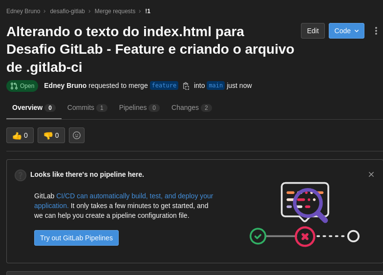

# E como mostra a imagem foi feito o deploy do site.

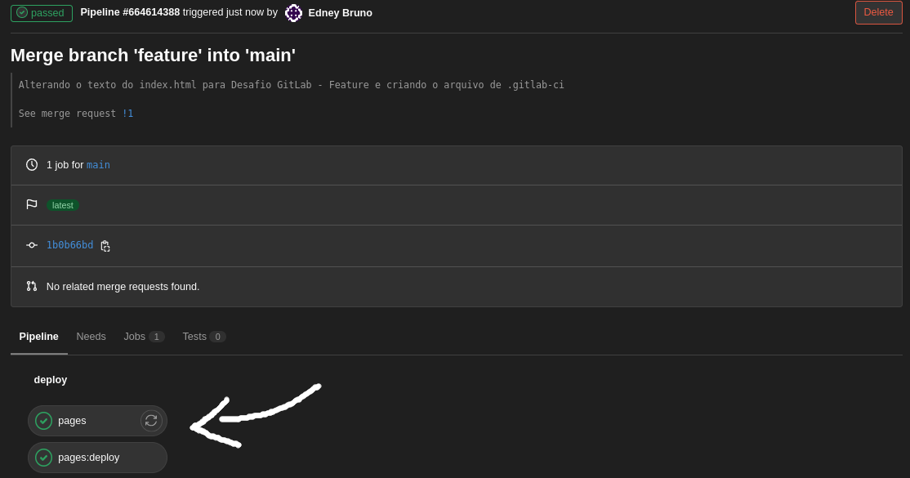

### 9.Encontre o endereço do seu site no GitLab.

# Este é o endereço do site.

[Site] (https://edneybruno.gitlab.io/desafio-gitlab)

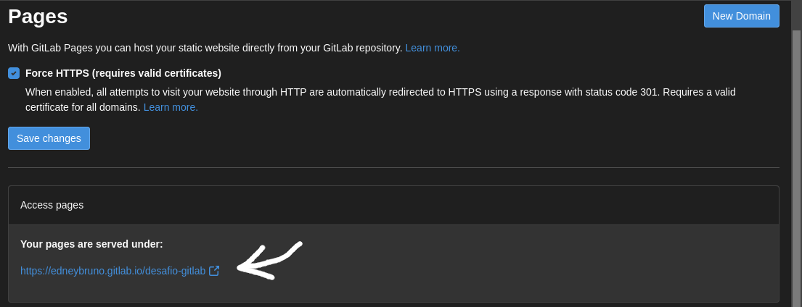

### 10.Acesse a página inicial do seu projeto no Gitlab e verifique se o texto foi alterado.

# Aqui mostra que o texto foi alterado.

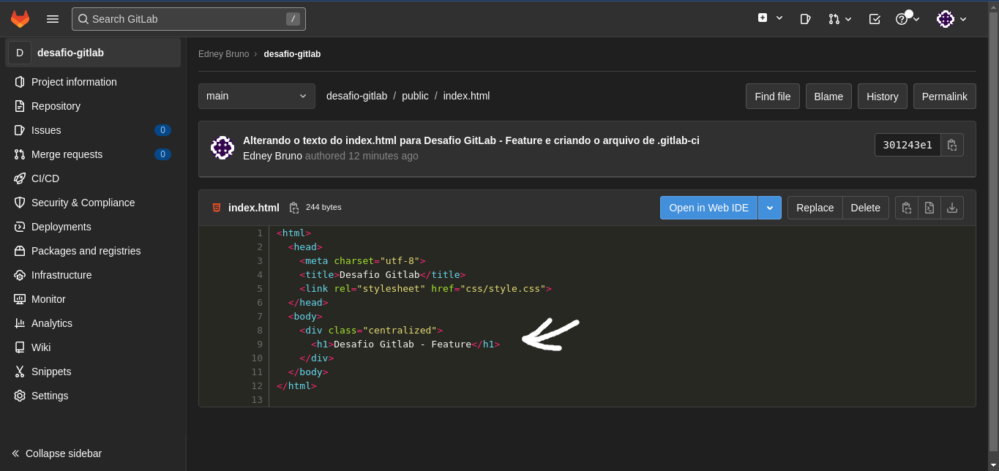

### 11.Adicione no arquivo RESPOSTAS.md o link para o seu repositório e o log do git com o histórico de commits. Envie também um screenshot da Gitlab Page criada.

# Link do repositório do desafio:

[Repositório] (https://gitlab.com/edneybruno/desafio-gitlab)

# Log de Commits
```
git log
```

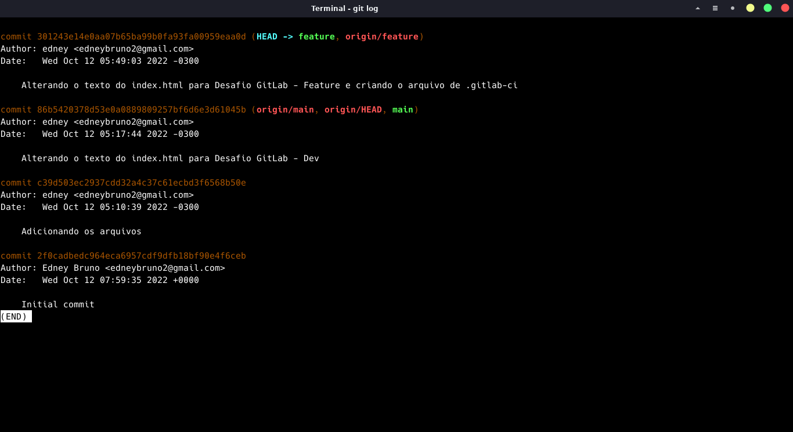

# Gitlab Page Criada:

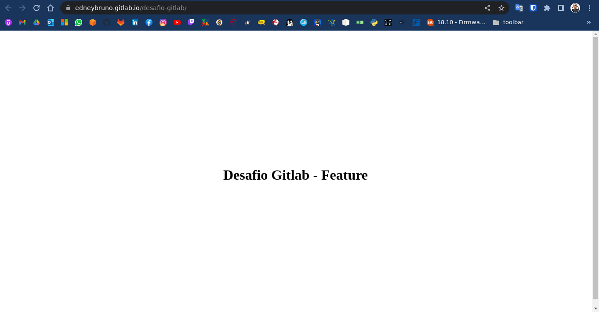
